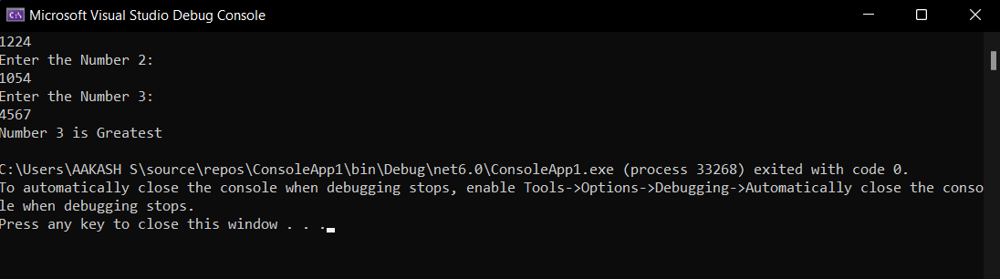

# Largest-of-three-numbers
## Aim:
To write a C# program to find the largest of three numbers

## Algorithm:
### Step1: 
Start
### Step2:
Create a class and declare three variable with integer datatype
### Step3:
Use if condition to check whether num1 is largest than num2 and num3
### Step4:
Use elif condition to check whether num2 is largest than num1 and num3
### Step5:
Use else condition to display that third variable is largest among all the variables
### Step6:
stop

## Program:
```
using System;

namespace ConsoleApp1
{
    class Program
    {

        static void Main(string[] args)
        {
            int num1,num2,num3;
            Console.WriteLine("Enter the Number 1: ");
            num1 = Convert.ToInt32(Console.ReadLine());
            Console.WriteLine("Enter the Number 2: ");
            num2 = Convert.ToInt32(Console.ReadLine());
            Console.WriteLine("Enter the Number 3: ");
            num3 = Convert.ToInt32(Console.ReadLine());
            if(num1> num2 && num1>num3)
            {
                Console.WriteLine("Number 1 is Greatest");
            }
            else if(num2>num3 && num2>num3)
            {
                Console.WriteLine("Number 2 is Greatest");
            }
            else
            {
                Console.WriteLine("Number 3 is Greatest");
            }
        }
    }
}
```
## Output:

## Result:
Thus the C# program to find the largest of three numbers is executed successfully
